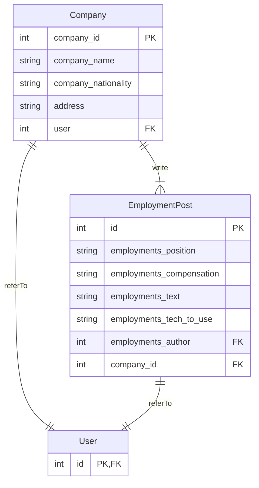

# wanted_pre_onboarding
프리온보딩 백엔드 코스 4차 선발과제

---

```mermaid
erDiagram

Company ||--|{ EmploymentPost : write
Company ||--|| User : referTo
EmploymentPost ||--|| User : referTo

Company{
    int company_id PK
    string company_name
    string company_nationality
    string address
    int user FK
}

EmploymentPost{
    int id PK
    string employments_position
    string employments_compensation
    string employments_text
    string employments_tech_to_use
    int employments_author FK
    int company_id FK
}

User{
    int id PK, FK
}
```