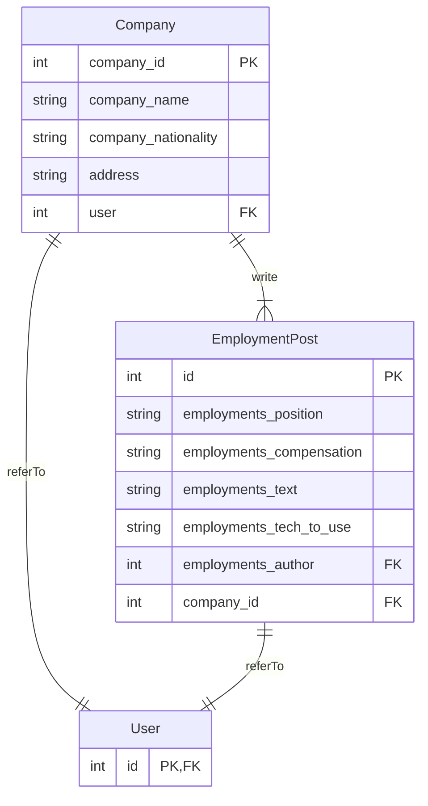

# wanted_pre_onboarding
프리온보딩 백엔드 코스 4차 선발과제 (tailwindcss 사용으로 css의 비중이 높게 나옴)

---

## ERD 설계

- 엔티티는 총 3개로 `Company`, `EmoloymentsPost`, `User` 입니다.
- `User` 엔티티는 django가 기본으로 제공하는 모델을 사용하였습니다.
- `Company`와 `EmploymentPost`는 `User`를 하나만 가질 수 있습니다.
    1.  `Company`에 들어갈 수 있는 `User`는 단 한 명뿐이라 가정하였습니다.
    2. 공동저자(`EmploymentsPost`의 `author`)는 없다고 가정하였습니다.
    3. `Company`, `EmoloymentsPost`의 레코드는 user가 삭제되면 같이 삭제됩니다.
- (의도) `Company`는 `User`와 1:1관계로 매핑되어 있으며 이는 `Company`에 등록된 단 한 명의 user로 작동하기 원해서 입니다. 
    - 오직 한 명의 유저만 자신의 글을 관리할 수 있다는 개념.....
    
---

## 2. 기능 구현
### 2.1. 리스트뷰 구현하기
- 사용자는 '주소/employments/'로 employments app의 기능을 이용할 수 있습니다. (채용공고: 리스트뷰, 디테일뷰, 검색, 삭제 등)
```python
# mysite/urls.py
urulpatterns = [
    path('employments/', include('employments.urls')),
    ...
]
```

- 사용자는 회사가 올린 채용공고 목록을 곧바로 볼 수 있습니다. (리스트 뷰)
```python
# employments/urls.py
urulpatterns = [
    path('', views.EmploymentsPostListView.as_view()),
]
```

```python
# views.py
class EmploymentsPostListView(ListView):
    model = EmploymentsPost
```


