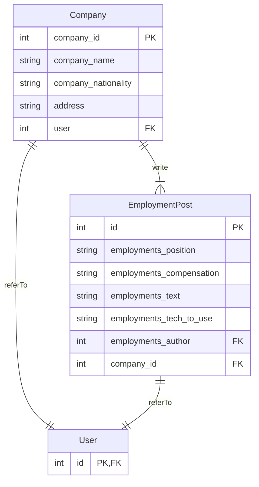
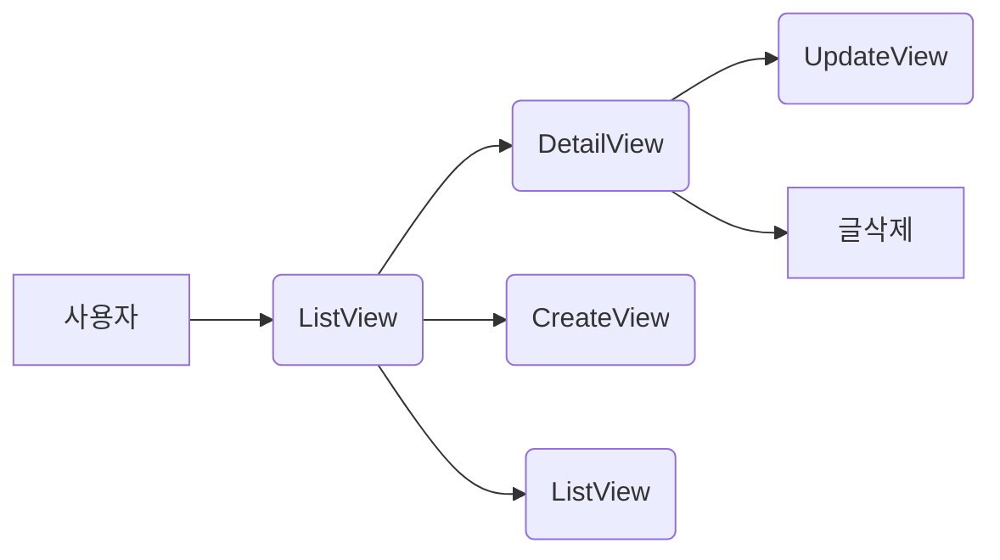
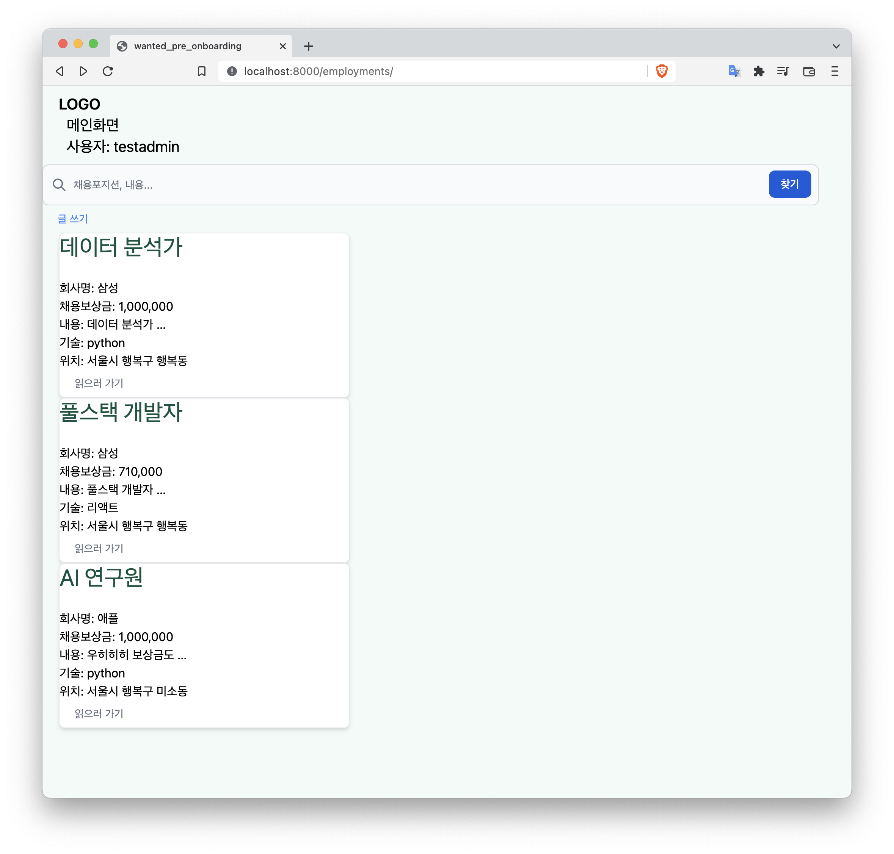

# wanted_pre_onboarding
프리온보딩 백엔드 코스 4차 선발과제 (tailwindcss 사용으로 css의 비중이 높게 나옴)

---

## ERD 설계

- 엔티티는 총 3개로 `Company`, `EmoloymentsPost`, `User` 입니다.
- `User` 엔티티는 django가 기본으로 제공하는 모델을 사용하였습니다.
- `Company`와 `EmploymentPost`는 `User`를 하나만 가질 수 있습니다.
    1.  `Company`에 들어갈 수 있는 `User`는 단 한 명뿐이라 가정하였습니다.
    2. 공동저자(`EmploymentsPost`의 `author`)는 없다고 가정하였습니다.
    3. `Company`, `EmoloymentsPost`의 레코드는 user가 삭제되면 같이 삭제됩니다.
- (의도) `Company`는 `User`와 1:1관계로 매핑되어 있으며 이는 `Company`에 등록된 단 한 명의 user로 작동하기 원해서 입니다. 
    - 오직 한 명의 유저만 자신의 글을 관리할 수 있다는 개념.....
    
---

## 2. 기능 구현  
### 2.1.  모델링 하기
- 위에서 설계한 ERD를 바탕으로 `Company`와 `EmoloymentsPost`의 [모델을 구현](https://github.com/eod940/wanted_pre_onboarding/blob/main/employments/models.py)하였습니다.
- 사용자는 '주소/employments/{ any }'로 employments app에서 제공하는 CRUD룰 이용할 수 있습니다. 
- 사용자는 메인화면을 리스트 뷰로 만나게 됩니다. 위에서 언급한 CRUD 기능은 [employments/urls.py](https://github.com/eod940/wanted_pre_onboarding/blob/main/employments/urls.py)에 명시되어 있는 방식으로 작동합니다.

#### 2.1.1. IA(정보 구조도)
- 사용자가 확인할 수 있는 정보의 구조는 아래 표와 같습니다.
    - 사용자 --> 메인화면(ListView) --> 상세정보(DetailView) & 글쓰기(CreateView) & 검색
    - 상세정보(DetailView) --> 글수정(UpdateView) & 글삭제



### 2.2. 리스트뷰 구현하기
- 사용자는 회사가 올린 채용공고 목록을 곧바로 볼 수 있습니다.
- 메인화면은 Django에서 제공하는 ListView를 이용하였습니다.
- 사용자의 요청 흐름에 따른 코드는 다음과 같습니다.

```python
# mysite/urls.py
urlpatterns = [
    path('employments/', include('employments.urls')),
    ...
]
```

- 사용자는 회사가 올린 채용공고 목록을 곧바로 볼 수 있습니다. (리스트 뷰)
```python
# employments/urls.py
urlpatterns = [
    path('', views.EmploymentsPostListView.as_view()),
]
```

```python
# views.py
class EmploymentsPostListView(ListView):
    model = EmploymentsPost
```



### 2.3. 채용공고 상세페이지 구현하기
- 사용자는 메인화면(ListView)에서 게시글을 클릭하면 [상세페이지(DetailView)](https://github.com/eod940/wanted_pre_onboarding/blob/main/employments/views.py)를 볼 수 있습니다.
- 상세페이지는 Django에서 제공하는 DetailView를 이용하였습니다.
- 상세페이지 url은 EmploymentsPost 모델의 pk를 이용했습니다.
- 사용자의 요청 흐름에 따른 코드는 다음과 같습니다.

```html
<!-- employmentspost_list.html -->
...
<button type="button" class="..."
        onclick="location.href='{{ employment_post.pk }}'">읽으러 가기</button>
...
```

```python
# employments/urls.py
urlpatterns = [
    path('<int:pk>/', views.EmploymentsPostListView.as_view()),
]
```

```python
# views.py
class EmploymentsPostDetailView(DetailView):
    model = EmploymentsPost
```